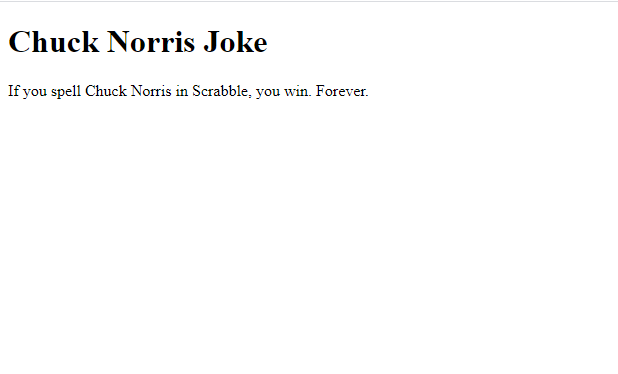

# Spring Jokes App

A Spring Boot app which generates Chuck Norris jokes using the following dependency:

```
<dependency>
    <groupId>guru.springframework</groupId>
    <artifactId>chuck-norris-for-actuator</artifactId>
    <version>2.4.0</version>
</dependency> 
```

### Instructions

```
git clone https://github.com/KajcsaErno/spring-jokes-app
maven package
mvn clean install
mvn spring-boot:run
```

Open in browser: http://localhost:8080/





